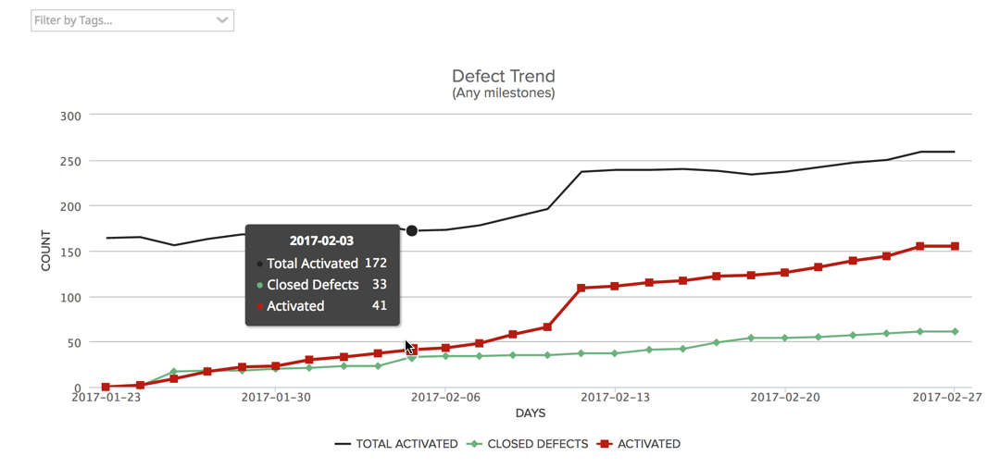
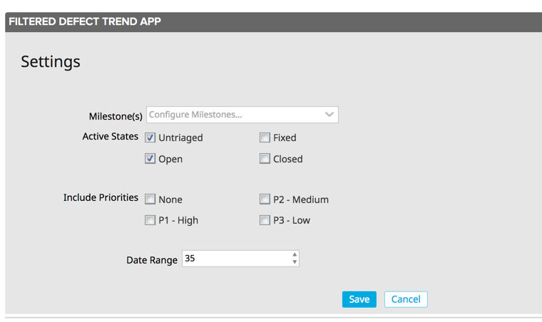

#Filtered Defect Trend App

## Summary/Description
Displays defect trend for the selected filter criteria (filtered by Milestone + Priority).  

The "Activated" and "Closed Defects" trend begins at 0 on the first day of the chart.  

Each day after that:
*  if a defect is transitioned into a non-active state, then that will be reflected in the "Closed Defects" line.  This line is a cumulative count of defects closed since the first day of the chart.  
*  if a new defect is added, then that will be reflected in the "Activated" defects line.  This is also a cumulative count of defects added since the first day of the chart.  If a defect is added and 
then immediately closed, 1 count will be added to both lines for that day.  

The "Total Activated" defects represents the total number of defects that were in an active state.

## App Settings

##### Milestones
Choose 0 to many milestones to filter the defects by.  Defects will meet the filter criteria if they have at least one of the chosen milestones.
If no milestones are selected, then there will be no milestone filter applied.  

##### Active States
These are the states that are considered "Active".  If a defect is in one of these states, it will be included in the "Total Active Defects" count and the "Active Defects" line.  
States not marked as Active will be considered closed and the defect count will be incremented each time a defect is transitioned into one of the "non-active" states. 

##### Include Priorities
If 1 or more priorities are selected, then only defects that fall into that priority category at the time of measure will be included in the dataset.  
If 0 priorities are selected, then all priorities will be included in the dataset.  

##### Date Range
The number of days back to show

## Notes
This app is scoped to the entire workspace.  

## Development Notes

### First Load

If you've just downloaded this from github and you want to do development, 
you're going to need to have these installed:

 * node.js
 * grunt-cli
 * grunt-init
 
Since you're getting this from github, we assume you have the command line
version of git also installed.  If not, go get git.

If you have those three installed, just type this in the root directory here
to get set up to develop:

  npm install

### Structure

  * src/javascript:  All the JS files saved here will be compiled into the 
  target html file
  * src/style: All of the stylesheets saved here will be compiled into the 
  target html file
  * test/fast: Fast jasmine tests go here.  There should also be a helper 
  file that is loaded first for creating mocks and doing other shortcuts
  (fastHelper.js) **Tests should be in a file named <something>-spec.js**
  * test/slow: Slow jasmine tests go here.  There should also be a helper
  file that is loaded first for creating mocks and doing other shortcuts 
  (slowHelper.js) **Tests should be in a file named <something>-spec.js**
  * templates: This is where templates that are used to create the production
  and debug html files live.  The advantage of using these templates is that
  you can configure the behavior of the html around the JS.
  * config.json: This file contains the configuration settings necessary to
  create the debug and production html files.  
  * package.json: This file lists the dependencies for grunt
  * auth.json: This file should NOT be checked in.  Create this to create a
  debug version of the app, to run the slow test specs and/or to use grunt to
  install the app in your test environment.  It should look like:
    {
        "username":"you@company.com",
        "password":"secret",
        "server": "https://rally1.rallydev.com"
    }
  
### Usage of the grunt file
####Tasks
    
##### grunt debug

Use grunt debug to create the debug html file.  You only need to run this when you have added new files to
the src directories.

##### grunt build

Use grunt build to create the production html file.  We still have to copy the html file to a panel to test.

##### grunt test-fast

Use grunt test-fast to run the Jasmine tests in the fast directory.  Typically, the tests in the fast 
directory are more pure unit tests and do not need to connect to Rally.

##### grunt test-slow

Use grunt test-slow to run the Jasmine tests in the slow directory.  Typically, the tests in the slow
directory are more like integration tests in that they require connecting to Rally and interacting with
data.

##### grunt deploy

Use grunt deploy to build the deploy file and then install it into a new page/app in Rally.  It will create the page on the Home tab and then add a custom html app to the page.  The page will be named using the "name" key in the config.json file (with an asterisk prepended).

To use this task, you must create an auth.json file that contains the following keys:
{
    "username": "fred@fred.com",
    "password": "fredfredfred",
    "server": "https://us1.rallydev.com"
}

(Use your username and password, of course.)  NOTE: not sure why yet, but this task does not work against the demo environments.  Also, .gitignore is configured so that this file does not get committed.  Do not commit this file with a password in it!

When the first install is complete, the script will add the ObjectIDs of the page and panel to the auth.json file, so that it looks like this:

{
    "username": "fred@fred.com",
    "password": "fredfredfred",
    "server": "https://us1.rallydev.com",
    "pageOid": "52339218186",
    "panelOid": 52339218188
}

On subsequent installs, the script will write to this same page/app. Remove the
pageOid and panelOid lines to install in a new place.  CAUTION:  Currently, error checking is not enabled, so it will fail silently.

##### grunt watch

Run this to watch files (js and css).  When a file is saved, the task will automatically build and deploy as shown in the deploy section above.

